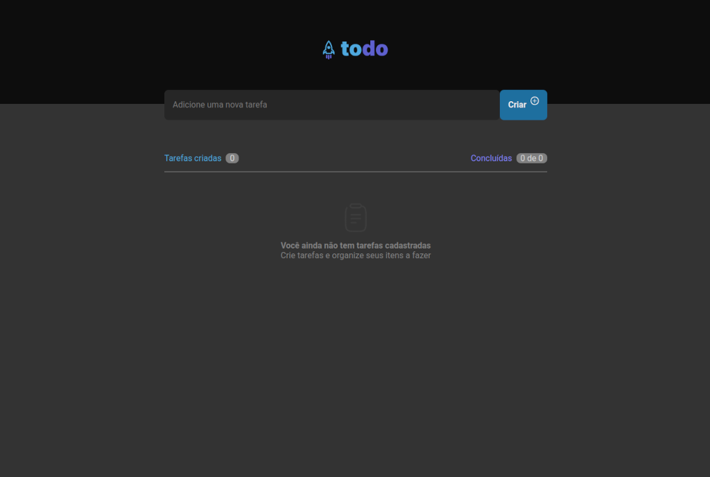
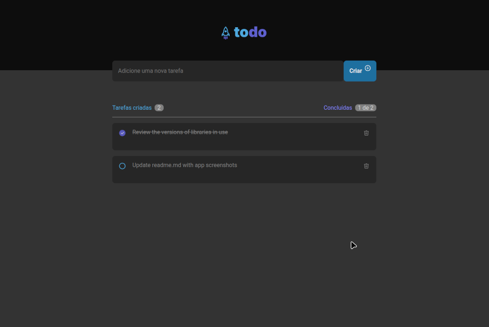

# ToDo List Application

## Overview
This project is a simple web ToDo List application built using ReactJS, Vite and TypeScript to run in a browser.
 It allows users to add, delete, and mark tasks when done. The application is designed to be user-friendly and responsive.

## Most Used Libraries
- **ReactJS**: A JavaScript library for building user interfaces.
- **Styled Components**: For styling the components using tagged template literals.
- **TypeScript**: A typed superset of JavaScript that compiles to plain JavaScript.

## Project Characteristics
- **Application UI**: Features a header to insert new tasks and an area for the to-do list.
- **Task Management**: Users can add new tasks, delete tasks, and mark tasks as done.

## How to Use the App (Requirements)
1. **Node.js**: [NodeJS LTS](https://nodejs.org)
2. **Yarn**: [Yarn Package Manager](https://yarnpkg.com)
3. **Clone the Repository**: `git clone https://github.com/lgturatti/rocketseat/tree/main/reactJS/toDoList`
4. **Install Dependencies**: Navigate to the project folder and run `yarn install`.
5. **Start the Application**: Run `yarn start` to start the application in your browser.

## Proposals for Updates and Improvements
- **User Authentication**: Implement backend logic for user authentication and task database.
- **Edit Task Functionality**: Implement the ability to edit existing tasks.
- **Category Management**: Add functionality to add or remove categories.
- **Filtering**: Tasks can be filtered by their status (done, not done, all) and by categories.
- **Dark Mode**: Add a dark mode option for better user experience.
- **Mobile Optimization**: Improve the responsiveness for mobile devices.

## Screenshots

 App screen without tasks

 App screen with pending task and completed task
